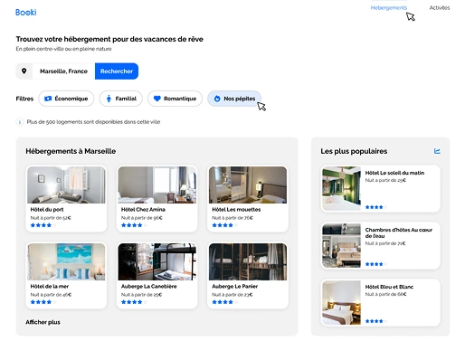

# Projet OC 2 - Booki

<i>Travail réalisé lors de la formation "Développeur Web" d'OpenClassrooms.<br>Base du code visible sur la branche Starter-code ou disponible [ICI](https://github.com/OpenClassrooms-Student-Center/booki-starter-code)</i>


<p align="center">
  
  
</p>


## 🎞️ Scénario
<i>Vous débutez votre alternance en tant que développeuse web au sein de la start-up **Booki**. L'entreprise souhaite développer un site Internet permettant aux usagers de trouver des hébergements et des activités dans la ville de leur choix.  
Votre mission est d'intégrer l'interface du site en **HTML** et **CSS**, en collaboration avec **Sarah**, la CTO, et **Loïc**, l'UI designer.</i>
<br><br>

## 🎯 Objectifs
- Implémenter une interface **responsive** (HTML/CSS).
- Intégrer du contenu conformément à une **maquette** fournie.
- Versionner un projet avec **Git** et **GitHub**.
<br><br>

## 💡 Technologies utilisées
- HTML5
- CSS3
<br><br>


## 📂 Structure
📁 OC_P2_BOOKI/<br>
│── 📁 images/<br> 
│── 📁 css/<br> 
│── index.html <br>
│── README.md
<br><br>

## 🚀 Installation
1. **Cloner** le dépôt GitHub :
   ```bash
   git clone https://github.com/HeleneC-cyber/OC_P2_BOOKI.git
2. **Naviguer** dans le répertoire du projet :
   ```bash
   cd OC_P2_BOOKI
3. **Ouvrir** le fichier index.html dans votre navigateur.
<br><br>


## 💻 Démonstration en ligne
👉 Voir le site en ligne [ICI](https://helenec-cyber.github.io/OC_P2_BOOKI/)
<br><br>

## 📝 Notes additionnelles
- Ce projet est centré sur l'intégration visuelle et non fonctionnelle.
- La barre de recherche sur mobile a nécessité une attention particulière pour correspondre à la maquette. Deux approches sont proposées sur le repo GitHub.
- Les bonnes pratiques de versionnement avec GitHub ont été respectées.
<br><br>


## 📬 Contact
Pour toute question ou suggestion, n'hésitez pas à me contacter sur [LinkedIn](https://www.linkedin.com/in/helene-canovas-48710b141/)